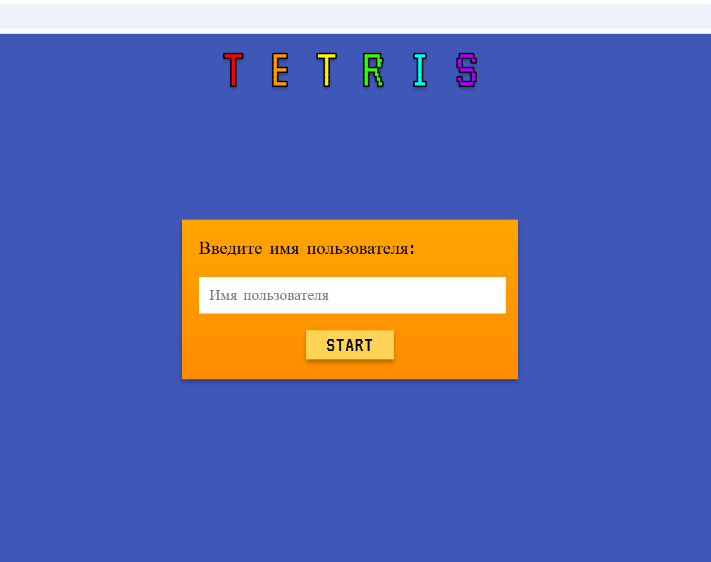
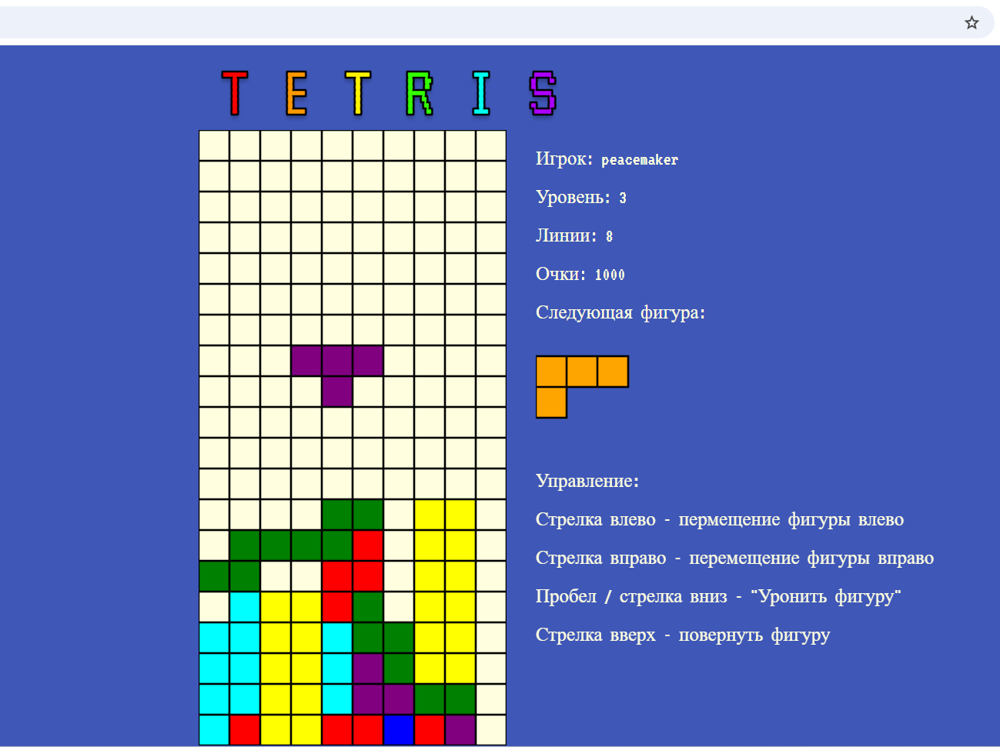
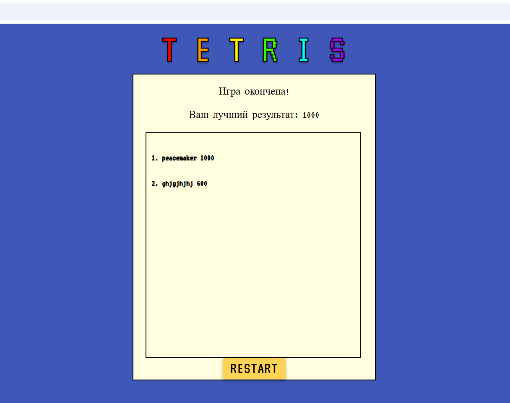

# Tetristopia

Tetristopia is a browser-based Tetris game built with vanilla JavaScript.
The project demonstrates modular architecture, DOM manipulation, and structured technical documentation.

This repository also serves as an example of production-style README documentation.


## Demo

### Start Screen


### Gameplay


### Game Over


To run the project locally, follow the installation instructions below.


## Tech Stack

- JavaScript (ES6)
- HTML5
- CSS3
- Canvas API
- LocalStorage


## Installation

### Run locally (recommended)

1. Clone the repository:

```bash
git clone https://github.com/Julia0021/browser-tetris-game.git
```

2. Navigate to the project folder:

```bash
cd browser-tetris-game
```

3. Start a local server:

```bash
npx serve .
```

4. Open http://localhost:3000 in your browser.


## Project Structure

```
tetristopia/
│
├── index.html        # Start screen
├── game.html         # Main game screen
├── end.html          # Game over screen
│
├── css/              # Styling files
├── js/               # Game logic modules
```


## Architecture Overview

The project follows a modular structure:

- gameBoard.js – manages board state
- tetramino.js – handles piece logic
- control.js – keyboard input handling
- visualization.js – rendering logic
- scoreTable.js – score management


## Game Logic

### Overview

The game logic follows the classic Tetris mechanics. Pieces (tetrominoes) are generated, fall down the board, and can be controlled by the player. When a horizontal line is fully filled, it is cleared and the player earns points. The game ends when new pieces can no longer be placed on the board.

---

### 1. Game Initialization

When the game starts:

- The board state is initialized as a 2D grid.
- A new random tetromino is generated.
- The main game loop begins.

---

### 2. Tetromino Generation

Tetrominoes are generated randomly from a predefined set of shapes.

Each piece:
- Has a matrix representation.
- Has a position on the board (x, y coordinates).
- Can be rotated (if no collision occurs).

---

### 3. Game Loop

The main loop runs on a timer interval and performs the following steps:

1. Move the active tetromino down by one cell.
2. Check for collisions:
   - Bottom boundary
   - Side boundaries
   - Other placed blocks
3. If collision is detected:
   - Lock the tetromino in place.
   - Check for completed lines.
   - Generate a new tetromino.

---

### 4. Player Controls

The player interacts with the game using keyboard input:

- Arrow Left → Move piece left
- Arrow Right → Move piece right
- Arrow Down → Accelerate falling
- Rotate key → Rotate piece

Each action validates movement before applying changes.

---

### 5. Collision Detection

Collision is checked when:

- Moving left or right
- Rotating
- Moving down automatically

A move is only applied if:
- The new position is inside board boundaries.
- The new position does not overlap existing locked blocks.

---

### 6. Line Clearing

After a piece is locked:

1. The board is scanned for fully filled horizontal rows.
2. Full rows are removed.
3. All rows above shift downward.
4. Score is updated accordingly.

---

### 7. Scoring System

Points are awarded when lines are cleared:
- 1 line → base score
- Multiple lines → increased reward

The current score is displayed during gameplay.

---

### 8. Game Over Condition

The game ends when a new tetromino cannot be placed at the initial spawn position.
After game over the final score is shown.

---


## Data Storage

Player scores are stored in the browser's localStorage.
Clearing browser data will reset the score table.


## Future Improvements

- Add backend-based score storage
- Improve UI/UX
- Add automated tests

